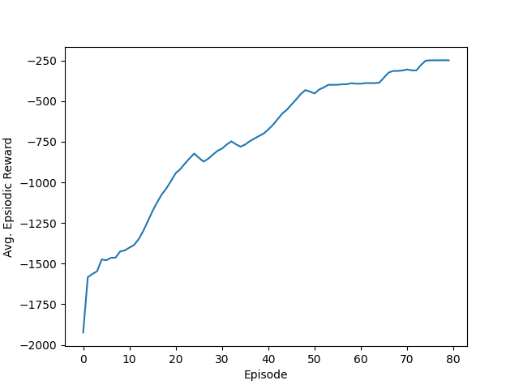
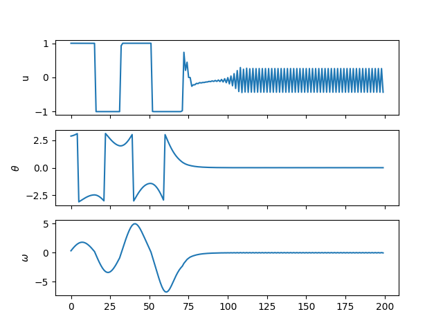

### DDPG
**Notes:**
1. For the open ai gym pendulum environment, the training completes in around 80 episodes
2. The ```Loop_handler``` context manager allows you to stop the iterations 
with ```Ctrl+C``` in a nice way so that the script can carry on after the loop. Credits to [Arthur Bouton](https://github.com/Bouty92/MachineLearning) for this script and a detailed description.
3. Example of how to use the DDPG class is shown in the python notebook ```DDPG.ipynb```

 
